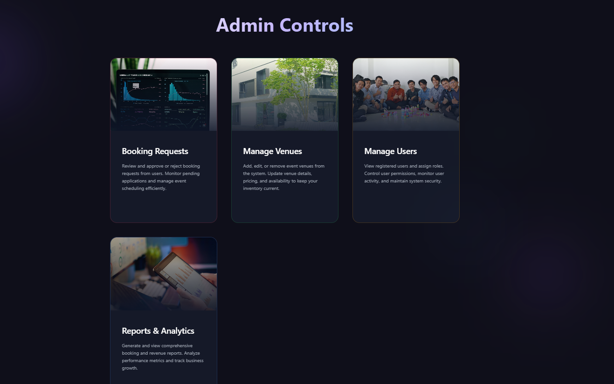

# 🎉 Sangam Event Management


Sangam is a **full-stack Event Management Web Application** designed to help users browse events, book venues, and manage event details efficiently. Built using **Spring Boot**, **Thymeleaf**, and **PostgreSQL**, it provides an intuitive and responsive interface for both admins and users.

---

## 📌 Features

- **🛡️ User Authentication & Roles**
    - Secure login and registration
    - Role-based access: Admin & User

- **🎈 Event Management**
    - Create, update, delete events
    - Categorize events (Wedding, Birthday, Corporate)
    - Upload event images
    - Manage capacity, pricing, and decoration options

- **🏛️ Venue Management**
    - Add and manage venues
    - Track bookings and availability

- **👥 User Functionalities**
    - Browse events by category
    - View detailed event information
    - Book events online

- **📱 Responsive Design**
    - Mobile-friendly UI using HTML, CSS, and Bootstrap

---

## 💻 Technology Stack

| Layer        | Technology |
| ------------ | ---------- |
| Backend      | Spring Boot, Java |
| Frontend     | Thymeleaf, HTML, CSS, Bootstrap |
| Database     | PostgreSQL |
| Security     | Spring Security |

---

## 🗂 Project Structure

Sangam-Event-Management/
│
├── src/main/java/com/example/eventManagement
│ ├── controller # Handles HTTP requests
│ ├── entity # JPA Entity classes
│ ├── repository # Database interactions
│ ├── service # Business logic
│ └── config # Security & App configurations
│
├── src/main/resources
│ ├── templates # Thymeleaf HTML pages
│ ├── static
│ │ ├── css
│ │ ├── js
│ │ ├── images
│ │ └── screenshots # Store screenshots here
│ └── application.properties
│
├── pom.xml
└── README.md

swift
Copy code

> 💡 **Tip:** Store your screenshots under `src/main/resources/static/screenshots/`  
> Example reference in README:

```markdown



📸 Screenshots
Homepage

Event Details

Admin Dashboard